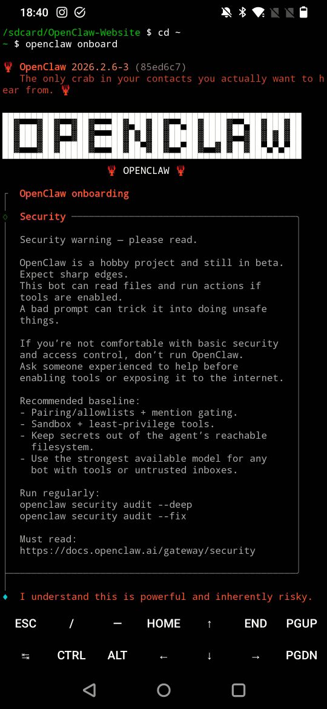
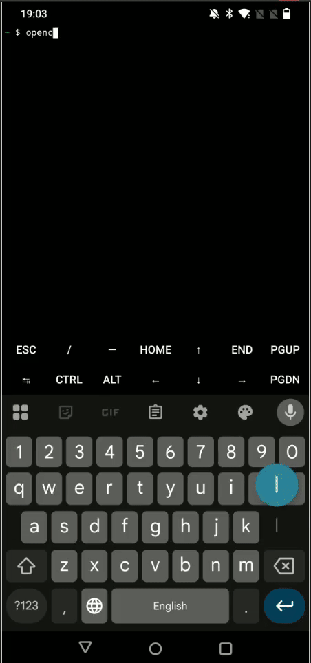

# OpenClaw Android Setup 🤖📱


<p align="center">   </p>

## Summary

Over the weekend I went down a rabbit hole with OpenClaw. I wanted to see if I could turn an old Android phone into a fully capable AI‑powered IoT device for future projects. After a lot of trial, error, and caffeine, I finally documented the entire process in my GitHub repo.

I’ve just released a project that lets you install OpenClaw directly on any Android device using Termux. No root. No hacks. Just clean setup. This instantly turns an old phone or tablet into a local AI assistant, an automation brain, or even a portable IoT controller.

+ Run OpenClaw directly on the device. Perfect for smart home flows, voice assistants, offline AI tasks, and edge computing experiments.

+ GPS, camera, mic, accelerometer, battery stats, network stack. All available out of the box. Your phone becomes a sensor hub or IoT gateway without extra hardware.

+ OpenClaw keeps running even when the app is closed. Ideal for long‑running automations.

+ Turn unused phones into AI hubs, IoT controllers, automation servers, or remote monitoring nodes.

If you’re into IoT, AI, automation, or edge computing, this opens up a lot of fun possibilities.

Here, I share a collection of specialized scripts to install and manage **OpenClaw** on Android devices using **Termux**.

OpenClaw usually targets server environments, but these scripts bridge the gap for mobile hardware by fixing hardcoded paths, handling non-root service management, and applying NodeJS workarounds for the Android NDK.

## 🎥 Video Tutorial

For a detailed walkthrough, check out our [[YouTube video](https://youtube.com/shorts/pWS5Mzb0YS0)]

## 📋 Prerequisites

Before starting, ensure you have the following:
- **Termux:** Downloaded from [F-Droid](https://f-droid.org/en/packages/com.termux/). **Do not use the Google Play version**, as it is outdated and incompatible.
- **Termux:API:** Install the [Termux:API app](https://f-droid.org/en/packages/com.termux.api/) from F-Droid. This is **required** for hardware features like notifications, battery status, and clipboard access. Without this, OpenClaw's mobile features will be significantly limited.

## 🚀 Quick Start (One-Liner)

To install everything automatically, open Termux and run:

```bash
pkg install -y git && git clone https://github.com/irtiq7/OpenClaw-Android.git ~/openclaw-android-setup && cd ~/openclaw-android-setup && chmod +x *.sh && ./setup_claw.sh
```

---

## 🛠️ Scripts Overview

### 1. `setup_claw.sh` (The Installer)
This script performs a complete environment preparation and installation.
- **System Prep:** Installs Node.js, Git, Python, Cmake, Ninja, and Build-Essentials.
- **Environment Fixes:** Configures `TMPDIR` and `TEMP` variables to point to valid Termux directories (preventing "Permission Denied" errors).
- **NDK Workaround:** Applies a dummy `.gyp` configuration to prevent compilation failures during native module installation.
- **Hardcoded Path Patch:** Automatically patches the OpenClaw source code to redirect `/tmp/openclaw` to a Termux-accessible path.
- **Service Management:** Sets up a persistent background service using `termux-services` (runit), allowing OpenClaw to run in the background without an active terminal window.

### 2. `update_claw.sh` (The Updater)
Use this whenever a new OpenClaw version is released.
- Safely stops the background service.
- Updates OpenClaw to the latest version via npm.
- **Critical:** Re-applies the hardcoded path patches (which are often lost during updates).
- Restarts the service automatically.

---

## 📋 Installation Steps

1. **Install Termux:** Download it from [F-Droid](https://f-droid.org/en/packages/com.termux/) (do not use the Play Store version).
2. **Run the Setup Script:**
   ```bash
   cd ~/openclaw-android-setup
   chmod +x *.sh
   ./setup_claw.sh
   ```
3. **Run Onboarding:**
   After the script finishes, run:
   ```bash
   openclaw onboard
   ```
   > **⚠️ IMPORTANT:** When asked if you want to install a "Daemon" or "System Service", **SAY NO**. The script has already handled this using a method compatible with Android.
4. **Finalize:**
   ```bash
   source ~/.bashrc
   sv up openclaw
   termux-wake-lock
   ```
   *The `termux-wake-lock` command is required to keep the CPU awake so OpenClaw doesn't get killed when you minimize the app.*

---

## 🔧 Managing OpenClaw

- **Check Status:** `sv status openclaw`
- **Stop Service:** `sv down openclaw`
- **Start Service:** `sv up openclaw`
- **View Logs:** `tail -f $PREFIX/var/log/openclaw/current`
- **Web UI Access:** Open your browser and go to `http://localhost:18789`

## 🤝 Credits
Created by [Irtiq7](https://github.com/irtiq7) & [Clawdy](https://openclaw.ai). 🦞✨
